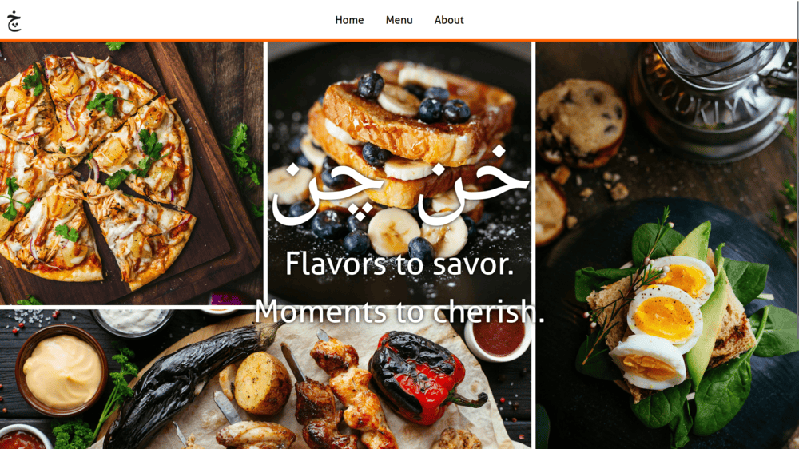

# Dynamic Restaurant Website

## Project Overview

This is a vanilla JavaScript restaurant website project built using Webpack, demonstrating dynamic DOM manipulation and modular JavaScript. This project was made as part of The Odin Project.

;

## Key Technologies Used

- Vanilla JavaScript
- Webpack
- npm

## Features

- Webpack-powered build process
- Modular page components
- Dynamic content rendering
- Tab-based navigation